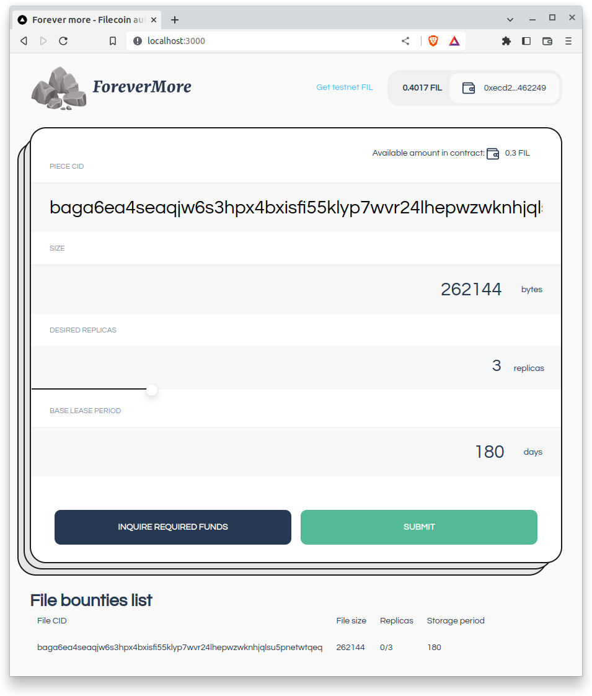
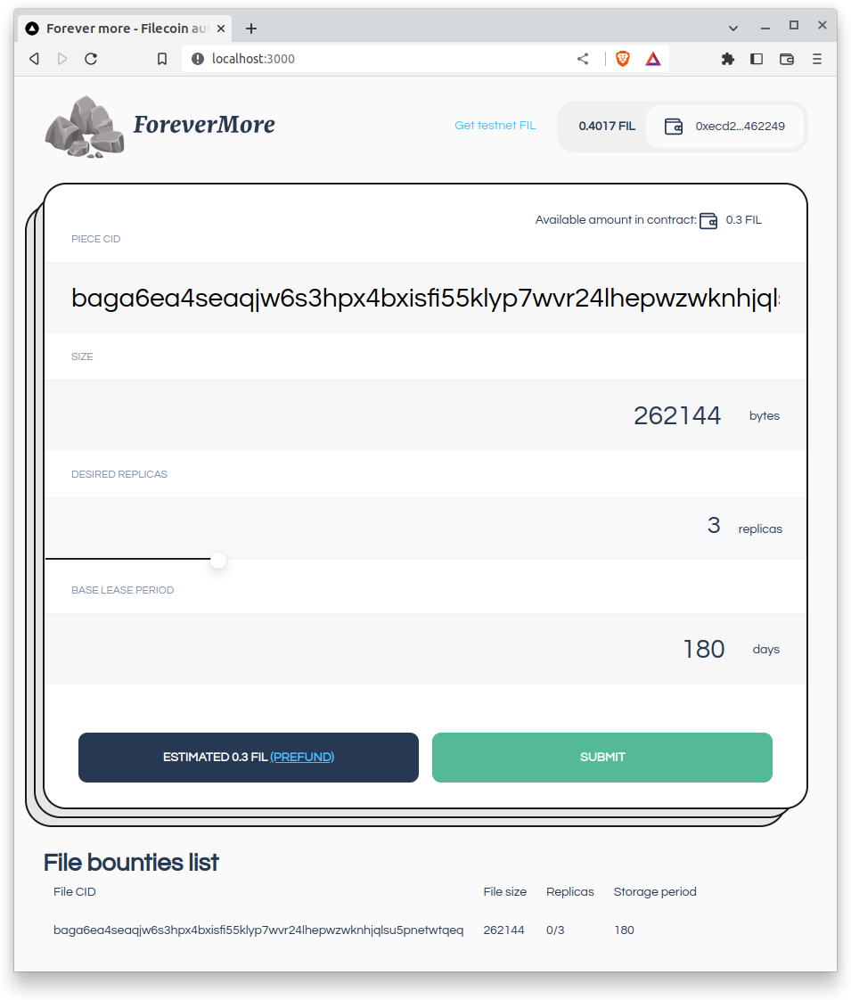
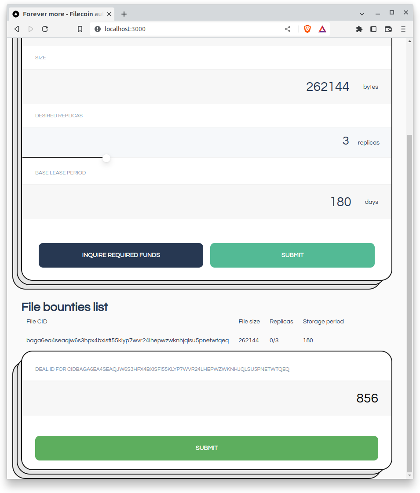

# ForeverMore dapp frontend

## Summary

This repository contains a dApp frontend that can be used as a starting point for a DAO operating on the Filecoin network.

The objective of the smart contract, called by this web app, is to manage the deals between two actors:
- simple users of the network, that want to store some files
- service providers that offer up their space in exchange of currency

At the same time the app aims to allow its users the option to store in a convenient way files, that are replicated over the network at any point in time. While for the storage providers it aims to provide a steady source of income from new storage bounties.

In current verion the basic user can create a storage deal offer/bounty for a file based on its CID. For each bounty he can
select:
- the desired amount of replicas that he wants to achive on the filecoin network
- the minimum storage period desired for each replica

Once the storage period for a replica has passed/expired it will try to make a new replica in the network for the same storage period that was first defined at the creation of the bounty. That will happen only if there are storage providers on the network willing to still take up the offer, and if the user that initiated the storage bounty has enough funds deposited in the contract.

This project has been developed as part of the [Spacewarp Virtual Hackaton 2023](https://ethglobal.com/events/spacewarp) and it was deployed on the Filecoint Hyperspace testnet.

## Usage scenarios

A typical interaction scenario with the contract will look like this (involving the two actors mentioned earlier):

- User1 wants to create a bounty for storing a file:
  - calls the contract to find out the amount of FIL he needs to pre-deposit to allow the creation of the bounty (based on the number of replicas, size and basic storage period)
  - deposits the amount of FIL specified by the contract
  - creates the file bounty, if the pre-deposit was not made the bounty will fail creation

- The Service Provider:
  - will get a list with the available bounties that don't have the replica expectation met.
  - selects one of the bounties it wants to complete
  - does the storage deal for the specified period of time in the bounty (outside the contract)
  - specifies the deal id for the bounty selected and if CID from the deal matches the one from the bounty he will get paid with the price of one replica.

## Running and developement:

This projects is forked from (Collectif frontend template)[https://github.com/collective-dao/collectif-fevm-frontend-template].

### Pre-requisites

- Node.js v12+
- Yarn package manager

### Development

Step 0. Read `DOCS.md` in the root of the project for project structure (not mandatory).

Step 1. Copy the contents of `.env` to `.env.local`

```bash
cp .env .env.local
```

Step 2. Fill out the `.env.local` with:

```
API_PROVIDER_URL_3141=https://api.hyperspace.node.glif.io/rpc/v1

DEFAULT_CHAIN=3141
SUPPORTED_CHAINS=3141

# comma-separated trusted hosts for Content Security Policy
# e.g. http://localhost:PORT for local development
CSP_TRUSTED_HOSTS=https://*.collectif.finance

# put "true" enable report only mode for CSP
CSP_REPORT_ONLY=true

# api endpoint for reporting csp violations
# for prod and dev use https and real domain
CSP_REPORT_URI=http://localhost/api/csp-report

# Matomo analytics
MATOMO_HOST='https://matomo.testnet.fi/'
```

Step 3. Install dependencies

```bash
yarn install
```

Step 4. Generate the contract factory and infer its types by running:
```yarn typechain
```

Step 5. Start the development server

```bash
yarn dev
```

Step 6. Open [http://localhost:3000](http://localhost:3000) with your browser to see the result.

### Production

```bash
yarn build && yarn start
```

## Screenshots:
Creating a bounty:

Get required funds for a bounty

Fill deal



## Known problems:

- There are still some bugs in the claimBounty function as the limited time available for the hackaton did not permit enough debugging.
- The Hyperspace RPC endpoint used to compute 'eth_maxPriorityFeePerGas' is proxied through: https://cors-anywhere.herokuapp.com/, because of CORS errors.
First go to https://cors-anywhere.herokuapp.com/demo to get access to the CORS proxy if the proxy is still available. Another solution would be to use in `hooks/maxPriorityFee.ts` an JSON RPC server that accepts cors request.